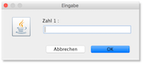

# Übungen


##### Übung 1 (Codereview und static)

??? "Was ist an diesem Code alles falsch?"

	```java
	package uebungen.uebung1;

	/*
	 * °C = (°F - 32) * 5/9 (von Fahrenheit in Celsius)
	 * °F = °C * 1,8 + 32 (von Celsius nach Fahrenheit)
	 */

	public class Konvertierung {
		
		private double celsius;
		private double fahrenheit;
		
		public Konvertierung(double celsius) 
		{		
			this.celsius = celsius;
			this.fahrenheit = celsius * 1.8 + 32;		
		}
		
		public Konvertierung(double fahrenheit) 
		{		
			this.celsius = fahrenheit - 32 * 5/9;
			this.fahrenheit = fahrenheit;		
		}
		
		public void print()
		{
			System.out.println(this.celsius + "\u00B0C = " + this.fahrenheit + "\u00B0F");
		}
	}
	```


??? success "Eine mögliche Lösung für Übung 1"
	```java
	package uebungen.uebung1;

	/*
	 * °C = (°F - 32) * 5/9 (von Fahrenheit in Celsius)
	 * °F = °C * 1,8 + 32 (von Celsius nach Fahrenheit)
	 */

	public class Konvertierung {

		private Konvertierung() {
			
		}
	    
	    public static double celsiusToFahrenheit(double celsius) {
	    	final double FACTOR_CELSIUS_TO_FAHRENHEIT = 1.8;
	    	final int DIFFERENCE_CELSIUS_TO_FAHRENHEIT = 32;
	    	
	    	double fahrenheit = celsius * FACTOR_CELSIUS_TO_FAHRENHEIT 
	    			+ DIFFERENCE_CELSIUS_TO_FAHRENHEIT; 
	    	
	    	return fahrenheit;
	    }
	    
	    public static double fahrenheitToCelsius(double fahrenheit) {
	    	final double FACTOR_FAHRENHEIT_TO_CELSIUS = 5.0/9.0;
	    	final int DIFFERENCE_FAHRENHEIT_TO_CELSIUS = 32;
	    	
	    	double celsius = (fahrenheit - DIFFERENCE_FAHRENHEIT_TO_CELSIUS) * FACTOR_FAHRENHEIT_TO_CELSIUS;
	   
	    	return celsius;
	    }
	}
	```

##### Übung 2 (String und algorithmisches Denken)

??? "Übung 2"

	1. Erstellen Sie im Paket `uebungen.uebung2` eine Java-Klasse `Uebung2` mit `main()`-Methode. In diese Klasse implementieren wir statische Methoden. Öffnen Sie zum Lösen der Übung am besten die JavaDoc-Dokumentation der Klasse [String](https://docs.oracle.com/en/java/javase/11/docs/api/java.base/java/lang/String.html). Überlegen Sie sich, bevor Sie jeweils anfangen zu implementieren, genau, wie Sie vorgehen möchten.

	2. Implementieren Sie eine Methode `static boolean isBinaryNumber(String s)`. Diese Methode überprüft, ob der `String s` einer Binärzahl entspricht, d.h. ob er nur `0` und `1` enthält. 

	3. Testen Sie die Methode `isBinaryNumber(String s)` z.B. mit den folgenden Aufrufen:
	```java
	System.out.println(isBinaryNumber("101101"));	// true
	System.out.println(isBinaryNumber("0"));		// true
	System.out.println(isBinaryNumber("101a01"));	// false
	System.out.println(isBinaryNumber("101201"));	// false
	```

	4. Implementieren Sie eine Methode `static int binaryToDecimal(String s)`. Diese Methode wandelt den `String s` in eine Dezimalzahl um, wenn `s` einer Binärzahl entspricht. Wenn `s` keiner Binärzahl entspricht, wird `-1` zurückgegeben. 

	5. Testen Sie die Methode `binaryToDecimal(String s)` z.B. mit den folgenden Aufrufen:
	```java
	System.out.println(binaryToDecimal("101101"));	// 45
	System.out.println(binaryToDecimal("0"));		// 0
	System.out.println(binaryToDecimal("000001"));	// 1
	System.out.println(binaryToDecimal("100000"));	// 32
	System.out.println(binaryToDecimal("101a01"));	// -1
	System.out.println(binaryToDecimal("101201"));	// -1
	```

	6. Implementieren Sie eine Methode `static String toLowerCase(String input)`. Diese Methode wandelt alle Großbuchstaben ('A'...'Z') in Kleinbuchstaben um (und nur diese - alle anderen Zeichen bleiben erhalten). Schauen Sie sich dazu auch nochmal die [ASCII-Tabelle](https://freiheit.f4.htw-berlin.de/prog1/variablen/#char) an.

	7. Testen Sie die Methode `toLowerCase(String input)` z.B. mit den folgenden Aufrufen:
	```java
	System.out.println(toLowerCase("abcdEFG"));		// abcdefg
	System.out.println(toLowerCase("abcd123EFG"));	// abcd123efg
	System.out.println(toLowerCase("ABC XYZ !%"));	// abc xyz !%
	```

	**Zusatz:**

	8. Implementieren Sie eine Methode `static boolean isPalindrome(String input)`. Diese Methode prüft, ob es sich bei `input` um ein Palindrom handelt (also von vorne nach hinten genauso gelesen werden kann, wie von hinten nach vorne). Groß- und Kleinschreibung wird nicht berücksichtigt! Die Methode [substring(int,int)](https://docs.oracle.com/en/java/javase/11/docs/api/java.base/java/lang/String.html#substring(int,int)) aus `String` ist dabei wahrscheinlich nützlich!

	9. Testen Sie die Methode `isPalindrome(String input)` z.B. mit den folgenden Aufrufen:
	```java
	System.out.println(isPalindrome("Otto"));		// true
	System.out.println(isPalindrome("abc_CBA"));	// true
	System.out.println(isPalindrome("abc_-CBA"));	// false
	System.out.println(isPalindrome("-"));			// true
	System.out.println(isPalindrome("Dreh mal am Herd"));	// false 
	```

	8. Angenommen, Sie sollen für einen gegebenen `String` angeben, ob er korrekt geklammerte Ausdrücke enthält (nur die Klammern betrachten). Wie würden Sie vorgehen? Nicht implementieren, nur nachdenken. Folgende Beispiele:
	```
	((()))()(()) 		// korrekt
	((())				// nicht korrekt
	(()))				// nicht korrekt
	())(				// nicht korrekt
	```

??? success "Eine mögliche Lösung für Übung 2"
	```java
	package uebungen.uebung2.loesung;

	public class Uebung2 {
		
		public static boolean isBinaryNumber(String s)
		{
			for(int index=0; index < s.length(); index++)
			{
				char c = s.charAt(index);
				if(!(c=='0' || c=='1'))
				{
					return false;
				}
			}
			return true;
		}
		
		public static int binaryToDecimal(String s)
		{
			if(!isBinaryNumber(s)) return -1;
			int decimalNumber = 0;
			int exp = 0;
			for(int index = s.length()-1; index >= 0; index--)
			{
				char c = s.charAt(index);
				int digit = c - '0';
				int value = digit * (int)Math.pow(2, exp);
				decimalNumber += value;
				exp++;
			}
			
			return decimalNumber;
		}
		
		public static String toLowerCase(String input)
		{
			String output = "";
			final int UPPER_TO_LOWER = 32;

			for(int index=0; index < input.length(); index++)
			{
				char c = input.charAt(index);
				if(c >= 'A' && c<= 'Z')
				{
					c = (char)(c + UPPER_TO_LOWER);
				}
				output += c;
			}
			return output;
		}
			
		public static boolean isPalindrome(String input)
		{
			String s = toLowerCase(input);
			boolean palindrome = true;
			while(palindrome && s.length() > 1)
			{
				char c1 = s.charAt(0); 
				char c2 = s.charAt(s.length() - 1);
				if(c1 == c2)
				{
					s = s.substring(1,s.length() - 1);
				}
				else 
				{
					palindrome = false;
				}
			}
			return palindrome;
		}
			
		public static boolean checkBraces(String input)
		{
			int nrOpening = 0;	// man koennte auch fuer jede oeffnende ++ und
			int nrClosing = 0;	// jede schliessende -- und dann nur eine Variable
								// dann pruefen, ob nie negativ
			boolean correct = true;
			for(int index=0; correct && index < input.length(); index++)
			{
				char c = input.charAt(index);
				if(c== '(') 
				{
					nrOpening++;
				}
				else if(c== ')') 
				{
					nrClosing++;
				}
				
				if(nrClosing > nrOpening)	// dann waere hier < 0
				{
					correct = false;
				}
			}
			if(nrOpening != nrClosing) 		// dann waere hier == 0
			{
				correct = false;
			}
			return correct;
		}

		public static void main(String[] args) {
			System.out.println(isBinaryNumber("101101"));	// true
			System.out.println(isBinaryNumber("0"));		// true
			System.out.println(isBinaryNumber("101a01"));	// false
			System.out.println(isBinaryNumber("101201"));	// false

			System.out.println(binaryToDecimal("101101"));	// 45
			System.out.println(binaryToDecimal("0"));		// 0
			System.out.println(binaryToDecimal("000001"));	// 1
			System.out.println(binaryToDecimal("100000"));	// 32
			System.out.println(binaryToDecimal("101a01"));	// -1
			System.out.println(binaryToDecimal("101201"));	// -1
			
			System.out.println(toLowerCase("abcdEFG"));		// abcdefg
			System.out.println(toLowerCase("abcd123EFG"));	// abcd123efg
			System.out.println(toLowerCase("ABC XYZ !%"));	// abc xyz !%
		
			System.out.println(isPalindrome("Otto"));		// true
			System.out.println(isPalindrome("abc_CBA"));	// true
			System.out.println(isPalindrome("abc_-CBA"));	// false
			System.out.println(isPalindrome("-"));			// true
			System.out.println(isPalindrome("Dreh mal am Herd"));	// false
			// das letzte waere okay, wenn man bei der Pruefung
			// die Leerzeichen ignorieren wuerde, waere auch moeglich
		}

	}
	```


##### Übung 3 (Exceptions)

??? "Übung 3"

	1. Schreiben Sie ein Programm zur Eingabe von zwei Zahlen mithilfe der Klasse `JOptionPane` und deren Division! Fangen Sie folgende Ausnahmen ab:
		- Falls die Eingabe keiner Zahl entspricht.
		- Falls die zweite Zahl eine 0 ist.

	2. **Scenario**:
		- Fenster zur Eingabe von Zahl 1 öffnet sich: <br/>
			
		- falsche Eingabe - keine Zahl:  <br/>
			
		- Fenster öffnet sich erneut (andere Nachricht!):  <br/>
			
		- Fenster zur Eingabe von Zahl 2 öffnet sich:  <br/>
			
		- die Division Zahl1/Zahl2 schlägt fehl (`ArithmeticException`), deshalb (andere Nachricht!):  <br/>
			
		- Ergebnis  <br/>
			

	3. Lagern Sie eine solche Eingabemöglichkeit in eine wiederverwendbare Methode aus, z.B. `public int inputInt(int min, int max)`, welche die eingegebene Zahl zurückgibt, wobei die eingegebene Zahl im Bereich `[min, max]` liegen muss.

	4. Lesen Sie eine Zahl ein und geben Sie die Zahl umgedreht (rückwärts gelesen) wieder aus (führende Nullen entfallen):
		```bash
		3456789 --> 9876543
		```

		```bash
		1000 --> 1
		```

	5. Lesen Sie eine Zahl ein und geben Sie die Quersumme der Zahl aus.

		```bash
		123456 --> 21
		```

		```bash
		1000 --> 1		
		```

	**Viel Spaß!**


